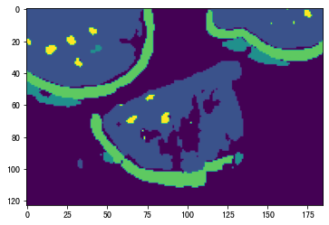
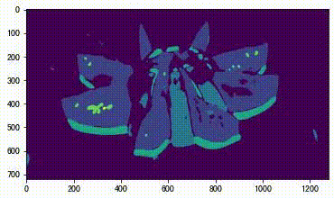

# Note，Tutorial and Assignment Results of "Semantic Segmentation With MMSeg"

#### 作业需要提交的文件
1. 训练config
2. 训练日志log和输出文件夹work_dirs
3. 测试图片视频原图即推理后的图片视频
4. 评估指标，config路径地址，log地址，图片视频地址放在提交文件夹的**readme.md**文件中

### 作业结果
**1. Config**

[`./mmsegmentation/pspnet-Watermelon87_Semantic_Seg_Mask_20230616.py`](./mmsegmentation/pspnet-Watermelon87_Semantic_Seg_Mask_20230616.py)

**2. Evaluation**
- aAcc: 94.2700  
- mIoU: 77.2600  
- mAcc: 86.7700 

**3. Training logs**

[./mmsegmentation/work_dirs/Watermelon87_Semantic_Seg_Mask/20230616_114954/20230616_114954.log](./mmsegmentation/work_dirs/Watermelon87_Semantic_Seg_Mask/20230616_114954/20230616_114954.log)

**4. Test logs**

Outputs is the same as the above train outputs since we test evey 400 epoch during training.
[.work_dirs/Watermelon87_Semantic_Seg_Mask/20230616_160732/20230616_160732.log](./mmsegmentation/work_dirs/Watermelon87_Semantic_Seg_Mask/20230616_160732/20230616_160732.log)

```
+------------+-------+-------+
|   Class    |  IoU  |  Acc  |
+------------+-------+-------+
|    Red     | 92.13 | 96.03 |
|   Green    | 87.87 | 91.65 |
|   White    | 77.85 | 91.88 |
| Seed-black | 84.83 | 93.94 |
| Seed-white | 68.25 | 73.52 |
| Unlabeled  | 52.67 |  73.6 |
+------------+-------+-------+
2023/06/16 12:09:59 - mmengine - INFO - Iter(val) [11/11]  
aAcc: 94.2700  mIoU: 77.2600  mAcc: 86.7700  data_time: 0.0016  time: 0.2658

2023/06/16 12:09:59 - mmengine - INFO - The previous best checkpoint /home/cine/Documents/GitHub/mmsegmentation/work_dirs/Watermelon87_Semantic_Seg_Mask/best_mAcc_iter_3600.pth is removed
2023/06/16 12:10:00 - mmengine - INFO - The best checkpoint with 86.7700 mAcc at 7600 iter is saved to best_mAcc_iter_7600.pth.
2023/06/16 12:10:00 - mmengine - INFO - The previous best checkpoint /home/cine/Documents/GitHub/mmsegmentation/work_dirs/Watermelon87_Semantic_Seg_Mask/best_mIoU_iter_2800.pth is removed
2023/06/16 12:10:01 - mmengine - INFO - The best checkpoint with 77.2600 mIoU at 7600 iter is saved to best_mIoU_iter_7600.pth.

```

**5. Test and Visualization**

Datafolder: [./mmsegmentation/data/](./mmsegmentation/data/)
1. Images 
<div align=left>


<br>


</div>
2. Videos

<div align=left>


</div>


## Assignment 4: Watermelon pixel-level semantic segmentation based on PSPNet

[[Description]](https://github.com/open-mmlab/OpenMMLabCamp/issues/388)
[[Data 1 (raw data)]](https://zihao-openmmlab.obs.cn-east-3.myhuaweicloud.com/20230130-mmseg/dataset/watermelon/Watermelon87_Semantic_Seg_Labelme.zip)
[[Data 2 (precessed data)]](https://zihao-openmmlab.obs.cn-east-3.myhuaweicloud.com/20230130-mmseg/dataset/watermelon/Watermelon87_Semantic_Seg_Mask.zip)
[[Code Base]](https://github.com/TommyZihao/MMSegmentation_Tutorials/tree/main/20230612/%E3%80%90C1%E3%80%91Kaggle%E5%AE%9E%E6%88%98-%E8%BF%AA%E6%8B%9C%E5%8D%AB%E6%98%9F%E8%88%AA%E6%8B%8D%E5%A4%9A%E7%B1%BB%E5%88%AB%E8%AF%AD%E4%B9%89%E5%88%86%E5%89%B2)
[[Video]](https://www.bilibili.com/video/BV1uh411T73q/)

### 作业详情

#### 背景：西瓜瓤、西瓜皮、西瓜籽像素级语义分割
#### TO DO LIST：
1. Labelme 标注语义分割数据集（子豪兄已经帮你完成了）
2. 划分训练集和测试集（子豪兄已经帮你完成了）
3. Labelme 标注转 Mask 灰度图格式（子豪兄已经帮你完成了）
4. **使用 MMSegmentation 算法库，撰写 config 配置文件，训练 PSPNet 语义分割算法**
5. **提交测试集评估指标**
6. **使用数据集之外的西瓜图片和视频进行预测，并存储展示预测的结果。**
7. **训练 Segformer 语义分割算法，提交测试集评估指标**

#### 西瓜瓤、西瓜籽数据集：
标注：同济子豪兄 


#### 数据集下载链接：
* Labelme标注格式（没有划分训练集和测试集）：https://zihao-openmmlab.obs.cn-east-3.myhuaweicloud.com/20230130-mmseg/dataset/watermelon/Watermelon87_Semantic_Seg_Labelme.zip
* Mask标注格式（已划分训练集和测试集）：https://zihao-openmmlab.obs.cn-east-3.myhuaweicloud.com/20230130-mmseg/dataset/watermelon/Watermelon87_Semantic_Seg_Mask.zip

#### 需提交的测试集评估指标：（不能低于 **baseline** 指标的 **50%** ）

- aAcc: 60.6200 
- mIoU: 21.1400 
- mAcc: 28.4600


# Note and Tutorial
## Environment Setup

```
cd code_path

git clone https://github.com/open-mmlab/mmsegmentation.git -b dev-1.x

cd mmsegmentation
pip install -e .
```

Organization of important files :

```
.
├── code_path
│   ├── mmsegmentation
│   │   ├── configs
│   │   │   ├── _base_
│   │   │   │   ├── datasets
│   │   │   │   │   ├── DubaiDataset_pipeline.py
│   │   │   │   │   └── Watermelon87Dataset_pipeline.py
│   │   │   │   ├── default_runtime.py
│   │   │   │   ├── models
│   │   │   │   │   └── pspnet_r50-d8.py
│   │   │   │   └── schedules
│   │   │   │       └── schedule_40k.py
│   │   │   └── pspnet
│   │   │       ├── pspnet_r50-d8_4xb2-40k_DubaiDataset.py
│   │   │       └── pspnet_r50-d8_4xb2-40k_Watermelon87Dataset.py
│   │   ├── data
│   │   │   ├── Watermelon87_Semantic_Seg_Mask
│   │   ├── mmseg
│   │   │   └── datasets
│   │   │       ├── DubaiDataset.py
│   │   │       ├── __init__.py
│   │   │       ├── StanfordBackgroundDataset.py
│   │   │       └── Watermelon87Dataset.py
... ...
│   └── MMSeg_tutorial
│   │   ├── 【A】安装配置MMSegmentation.ipynb
│   │   ├── 【B1】预训练语义分割模型预测-单张图像-命令行.ipynb
│   │   ├── 【B3】预训练语义分割模型预测-视频.ipynb
│   │   ├── 【C1】Kaggle实战-迪拜卫星航拍多类别语义分割
│   │   ├── 【C2】Kaggle实战-小鼠肾小球组织病理切片语义分割
│   │   ├── 【Z1】扩展阅读.ipynb
│   │   ├── 【Z2】MMSegmentation代码实战作业.ipynb
│   │   └── 【作业】西瓜多类别语义分割
│   │       ├── 【A】下载整理好的数据集.ipynb
│   │       ├── 【B】可视化探索数据集.ipynb
│   │       ├── 【C】准备config配置文件2.ipynb
│   │       ├── 【D】MMSeg训练语义分割模型-Copy1.ipynb
│   │       ├── 【E】可视化训练日志.ipynb
│   │       ├── 【F】用训练得到的模型预测-Copy1.ipynb
│   │       ├── 【G】测试集性能评估-Copy1.ipynb
│   │       ├── 【H1】语义分割模型预测-单张图像-命令行.ipynb
│   │       ├── 【H2】语义分割模型预测-视频.ipynb
│   │       └── 【H3】Test_with_python_file_on_Documents.ipynb
│   ├── good_codes [From https://github.com/zeyuanyin/OpenMMLabCamp/tree/main/homework-4]
│   │   ├── log
│   │   ├── modify_config.py
│   │   ├── pspnet-Watermelon.py
│   │   ├── run.py
│   │   ├── test_img
│   │   ├── test_img.py
│   │   └── test_video.py

```

## Fix data name error

rename:
```
./mmsegmentation/data/Watermelon87_Semantic_Seg_Mask/img_dir/train/21746.1.jpg ->  21746.jpg
./mmsegmentation/data/Watermelon87_Semantic_Seg_Mask/img_dir/val/01bd15599c606aa801201794e1fa30.jpg@1280w_1l_2o_100sh.jpg -> 01bd15599c606aa801201794e1fa30.jpg

```


## Config  
[**【作业】西瓜多类别语义分割/【C】准备config配置文件2.ipynb**](./MMSeg_tutorial/【作业】西瓜多类别语义分割/【C】准备config配置文件2.ipynb)

1. Define the Dataset Class (class name and color)
- Download `DubaiDataset.py` and Copy it as `Watermelon87Dataset.py`
```
wget https://zihao-openmmlab.obs.cn-east-3.myhuaweicloud.com/20230130-mmseg/Dubai/DubaiDataset.py -P mmseg/datasets
```
- Modify the `classes` in `./mmsegmentation/mmseg/datasets/Watermelon87Dataset.py` to `'classes':['Red', 'Green', 'White', 'Seed-black', 'Seed-white', 'Unlabeled']`
```python
# %load mmseg/datasets/Watermelon87Dataset.py
# 同济子豪兄 2023-2-15
from mmseg.registry import DATASETS
from .basesegdataset import BaseSegDataset

@DATASETS.register_module()
class Watermelon87Dataset(BaseSegDataset):
    # 类别和对应的可视化配色
    METAINFO = {
        'classes':['Red', 'Green', 'White', 'Seed-black', 'Seed-white', 'Unlabeled'],
        'palette':[[132,41,246], [228,193,110], [152,16,60], [58,221,254], [41,169,226], [155,155,155]]
    }
    
    # 指定图像扩展名、标注扩展名
    def __init__(self,
                 img_suffix='.jpg',
                 seg_map_suffix='.png',
                 reduce_zero_label=False, # 类别ID为0的类别是否需要除去
                 **kwargs) -> None:
        super().__init__(
            img_suffix=img_suffix,
            seg_map_suffix=seg_map_suffix,
            reduce_zero_label=reduce_zero_label,
            **kwargs)
```

2. Register the dataset class
- Download `__init__.py` and add related class related to `Watermelon87Dataset` and  `Watermelon87Dataset.py`
```
wget https://zihao-openmmlab.obs.cn-east-3.myhuaweicloud.com/20230130-mmseg/Dubai/__init__.py -P mmseg/datasets
```
```python
from .Watermelon87Dataset import Watermelon87Dataset
__all__ = [ 'Watermelon87Dataset']

```

3. Define the Dataset pipline for training and test
- Download `DubaiDataset_pipeline.py` and Copy it as `Watermelon87Dataset_pipeline.py`
```
wget https://zihao-openmmlab.obs.cn-east-3.myhuaweicloud.com/20230130-mmseg/Dubai/DubaiDataset_pipeline.py -P configs/_base_/datasets
```
- Change the `dataset_type` and `data_root` 
Modify the config file to fit the Watermelon dataset, add your data address
```python
# %load configs/_base_/datasets/Watermelon87Dataset_pipeline.py
# dataset settings
dataset_type = 'Watermelon87Dataset' # 数据集类名
data_root = 'data/Watermelon87_Semantic_Seg_Mask' # 数据集路径（相对于mmsegmentation主目录）
# ......
```

4. Download the Config document
- Download `pspnet_r50-d8_4xb2-40k_DubaiDataset.py.py`  and copy it as `./configs/pspnet/pspnet_r50-d8_4xb2-40k_Watermelon87Dataset.py`
```
wget https://zihao-openmmlab.obs.cn-east-3.myhuaweicloud.com/20230130-mmseg/Dubai/pspnet_r50-d8_4xb2-40k_DubaiDataset.py -P configs/pspnet 
```

Look at this config file, we need to copy the `pspnet_r50-d8.py`, `default_runtime.py`, `schedule_40k.py` from `mmsegmentation/configs/_base_/` to the current folder with the same structure path.

```python
_base_ = [
    '../_base_/models/pspnet_r50-d8.py', '../_base_/datasets/Watermelon87Dataset_pipeline.py',
    '../_base_/default_runtime.py', '../_base_/schedules/schedule_40k.py'
]
crop_size = (64, 64) # 输入图像尺寸，根据自己数据集情况修改
data_preprocessor = dict(size=crop_size)
model = dict(data_preprocessor=data_preprocessor)
```


```
# python ./good_codes/modify_config.py

```

The modified config file is saved at `./mmsegmentation/pspnet-Watermelon87_Semantic_Seg_Mask_20230616.py`.

## Train
[./MMSeg_tutorial/【作业】西瓜多类别语义分割/【D】MMSeg训练语义分割模型-Copy1.ipynb](./MMSeg_tutorial/【作业】西瓜多类别语义分割/【D】MMSeg训练语义分割模型-Copy1.ipynb)
```python
# python run.py  # ./good_codes/run.py
```

Outputs:

[./mmsegmentation/work_dirs/Watermelon87_Semantic_Seg_Mask/20230616_114954/20230616_114954.log](./mmsegmentation/work_dirs/Watermelon87_Semantic_Seg_Mask/20230616_114954/20230616_114954.log)
```
+------------+-------+-------+
|   Class    |  IoU  |  Acc  |
+------------+-------+-------+
|    Red     | 92.13 | 96.03 |
|   Green    | 87.87 | 91.65 |
|   White    | 77.85 | 91.88 |
| Seed-black | 84.83 | 93.94 |
| Seed-white | 68.25 | 73.52 |
| Unlabeled  | 52.67 |  73.6 |
+------------+-------+-------+
2023/06/16 12:09:59 - mmengine - INFO - Iter(val) [11/11]  
aAcc: 94.2700  mIoU: 77.2600  mAcc: 86.7700  data_time: 0.0016  time: 0.2658

2023/06/16 12:09:59 - mmengine - INFO - The previous best checkpoint /home/cine/Documents/GitHub/mmsegmentation/work_dirs/Watermelon87_Semantic_Seg_Mask/best_mAcc_iter_3600.pth is removed
2023/06/16 12:10:00 - mmengine - INFO - The best checkpoint with 86.7700 mAcc at 7600 iter is saved to best_mAcc_iter_7600.pth.
2023/06/16 12:10:00 - mmengine - INFO - The previous best checkpoint /home/cine/Documents/GitHub/mmsegmentation/work_dirs/Watermelon87_Semantic_Seg_Mask/best_mIoU_iter_2800.pth is removed
2023/06/16 12:10:01 - mmengine - INFO - The best checkpoint with 77.2600 mIoU at 7600 iter is saved to best_mIoU_iter_7600.pth.

```

## Test

[./MMSeg_tutorial/【作业】西瓜多类别语义分割/【H3】Test_with_python_file_on_Documents.ipynb](./MMSeg_tutorial/【作业】西瓜多类别语义分割/【H3】Test_with_python_file_on_Documents.ipynb)

```
python mmsegmentation/tools/test.py \
       pspnet-Watermelon.py \
       ../log/Watermelon/iter_3000.pth \
       --work-dir ../log/test

```
Outputs is the same as the above train outputs since we test evey 400 epoch during training.
[./mmsegmentation/work_dirs/Watermelon87_Semantic_Seg_Mask/20230616_160732/20230616_160732.log](./mmsegmentation/work_dirs/Watermelon87_Semantic_Seg_Mask/20230616_160732/20230616_160732.log)

## Inference on Watermelon Image
[【H1】语义分割模型预测-单张图像-命令行.ipynb](./MMSeg_tutorial/【作业】西瓜多类别语义分割/【H1】语义分割模型预测-单张图像-命令行.ipynb)
[【H3】Test_with_python_file_on_Documents.ipynb](./MMSeg_tutorial/【作业】西瓜多类别语义分割/【H3】Test_with_python_file_on_Documents.ipynb)
``` python
# python test_img.py
# ./good_codes/test_img.py

checkpoint_path = 'work_dirs/Watermelon87_Semantic_Seg_Mask/best_mAcc_iter_7600.pth'
# img_path = './data/watermelon.png'
img_path = './data/watermelon_2.png'

# Command 
python demo/image_demo.py \
        data/watermelon.png \
        pspnet-Watermelon87_Semantic_Seg_Mask_20230616.py\
        work_dirs/Watermelon87_Semantic_Seg_Mask/best_mAcc_iter_7600.pth \
        --out-file outputs/watermelon_pred.png \
        --device cuda:0 \
        --opacity 0.5
        
python demo/image_demo.py \
        data/watermelon_2.png \
        pspnet-Watermelon87_Semantic_Seg_Mask_20230616.py\
        work_dirs/Watermelon87_Semantic_Seg_Mask/best_mAcc_iter_7600.pth \
        --out-file outputs/watermelon_2_pred.png \
        --device cuda:0 \
        --opacity 0.5
        
```


<div align=left>


<br>


</div>


## Inference on Watermelon Video

Video Source: https://www.youtube.com/watch?v=yFPB5wct9KU


```
# Fast
# python test_video.py
# ./good_code/test_video.py
Assignment4/MMSeg_tutorial/【作业】西瓜多类别语义分割/【H2】语义分割模型预测-视频.ipynb
Assignment4/MMSeg_tutorial/【作业】西瓜多类别语义分割/【H3】Test_with_python_file_on_Documents.ipynb

```

<div align=left>


</div>

**Gif 生成方法(基于linux ffmpeg)**
```python
sudo snap install ffmpeg
sudo apt install yasm

ffmpeg -i ./data/watermelon.mp4 ./data/watermelon2.gif
ffmpeg -i ./data/watermelon_pred_2.mp4 ./data/watermelon_pred2_.gif
```


```
# Very slow with demo/image_demo.py （NOT Recommend）

!python demo/image_demo.py \
        data/watermelon_2.png \
        pspnet-Watermelon87_Semantic_Seg_Mask_20230616.py\
        work_dirs/Watermelon87_Semantic_Seg_Mask/best_mAcc_iter_7600.pth \
        --out-file outputs/watermelon_2_pred.png \
        --device cuda:0 \
        --opacity 0.3
```

# Reference

[https://github.com/zeyuanyin/OpenMMLabCamp/tree/main/homework-4](https://github.com/zeyuanyin/OpenMMLabCamp/tree/main/homework-4)

this repo helps me a lot in better writing a clear readme file and file organization of assignment files
